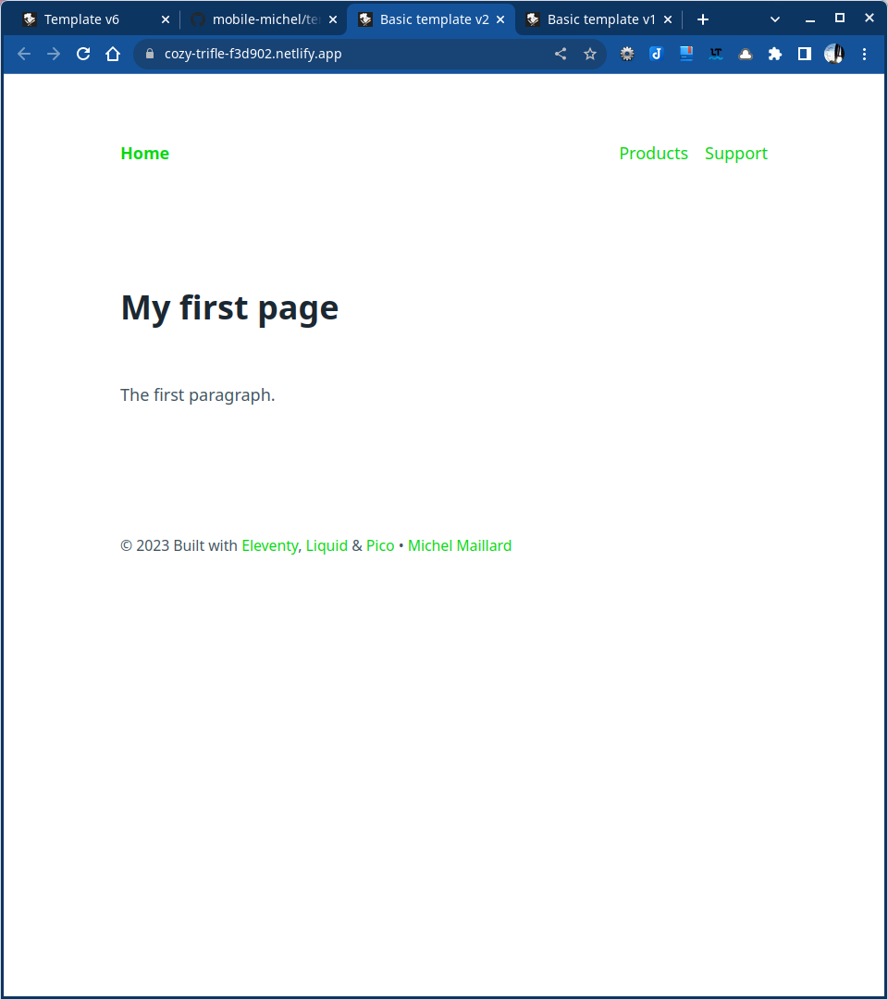

# Template 2

## Eleventy, Pico & Blueprint with Sass processing

1. Installation
2. Layout with global data
3. Install Pico.css with SCSS files processing (eleventy-sass plugin)
4. Create two pages for primary level + 404 page
5. Push to GitHub & deploy to Eleventy

